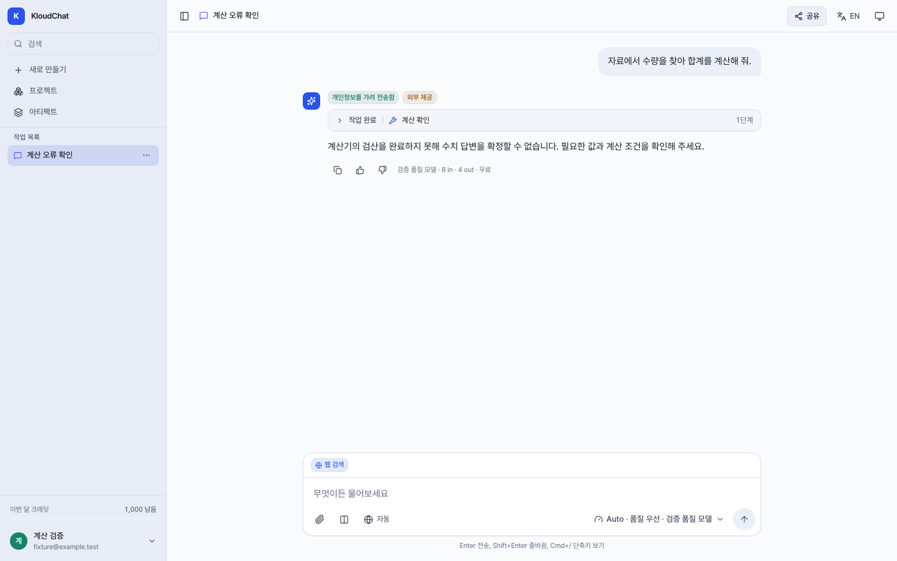
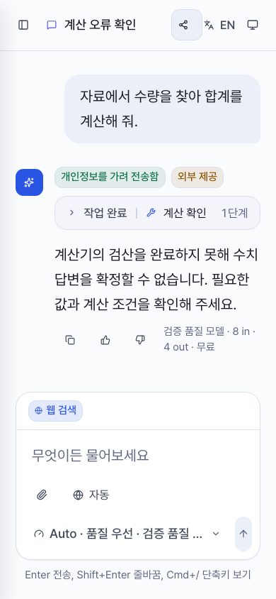

# Ordinary Calculation Hold Feedback

This follow-up is based on public PR183 source
`a37dbf1a5f810a9f18b4c4dbc8ba18fd9f0a12cc`. It changes only the fixed sentence
used when the existing preflight-failure branch holds an ordinary required
`calculate` request. It does not change the calculator gate, permissions,
prerequisite reads, retry/hop limits, model metadata, or token/credit handling.
NCS and other preflight contexts retain their original sentence.

The new ordinary-calculation sentence is:

> 계산기의 검산을 완료하지 못해 수치 답변을 확정할 수 없습니다. 필요한 값과 계산 조건을 확인해 주세요.

## Offline API Regression

The API verification owner ran the network-denied harness and recorded:

- Ten new cases: seven failed on the prior NCS wording and three controls passed
  before the product edit; socket/HTTP attempts were both zero.
- New cases plus prerequisite-read, bounded-repair and calculation-failure tests:
  54 passed; socket/HTTP attempts were both zero.
- Full standalone API suite: 2,979 passed, one existing skip, 11 warnings. The
  harness blocked 82 socket attempts and observed zero HTTP transport attempts.
- API Ruff and whitespace/diff checks passed.

Controls retain the one-repair limit, mandatory arithmetic after reads,
mixed-batch rejection, exhausted-hop/loop/runaway holds, unchanged NCS wording,
and ordinary successful arithmetic. No API server or model call was used for
this follow-up verification.

## Production Browser Verification

The existing calculation Playwright suite now contains 16 cases: its prior 12
plus four ordinary/NCS hold cases at 1440x900 and 390x844. All 16 passed without
skips, retries, flaky results, page errors or unexpected API requests.

The new cases render mocked SSE through the real production React application,
check the exact ordinary/NCS sentence and absence of an incorrect calculator-
authored-answer badge, then reload the mocked saved transcript. They verify one
submitted request and no horizontal overflow. They do not establish real API
sentence selection, database persistence, actual NCS dispatch or model behavior;
the separate API tests cover sentence selection.

The isolated preview served `/assets/index-Dyokbxgz.js`, not a development
entrypoint, with HTTP 200 for both index and bundle. Its API proxy used a dead
loopback port. TypeScript/production build, web lint and four Vite configuration
tests passed. Existing lint and bundle-size warnings remain. The owned preview
was stopped and its port was confirmed closed.

## Evidence Limits

The motivating actual result on frozen integration `2633d4f7` showed a server-
authored NCS-style hold for an ordinary missing-product total. This change only
makes that generic hold appropriate to a calculation context. It does not
identify product 103 as the missing operand, prove a missing source fact, accept
a model's unsupported missing-data assertion, or solve the grounding case.
No additional actual model replay was performed for this wording follow-up.
The earlier frozen integration/browser evidence must not be relabeled as a run
of this changed source.

## Screenshots

These are synthetic production mock-browser captures, not live provider output.
Their Auto-quality, external-provider and masking labels are fixture metadata,
not screenshots of the earlier strict-local or frozen 2633 actual runs. The
existing timeline summary can still say "작업 완료" above an error step; this
follow-up does not change that shared timeline presentation.
Desktop and mobile captures were inspected directly: the complete ordinary hold
sentence remains readable with no overlap. NCS controls retain their original
sentence in both viewports.

