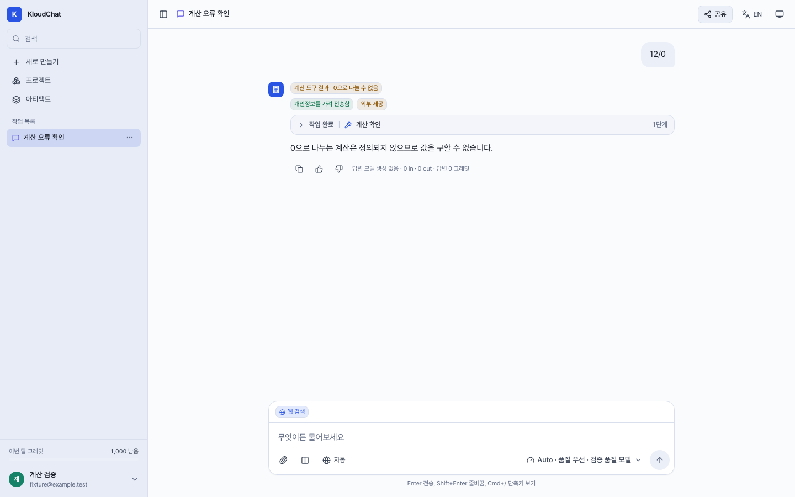
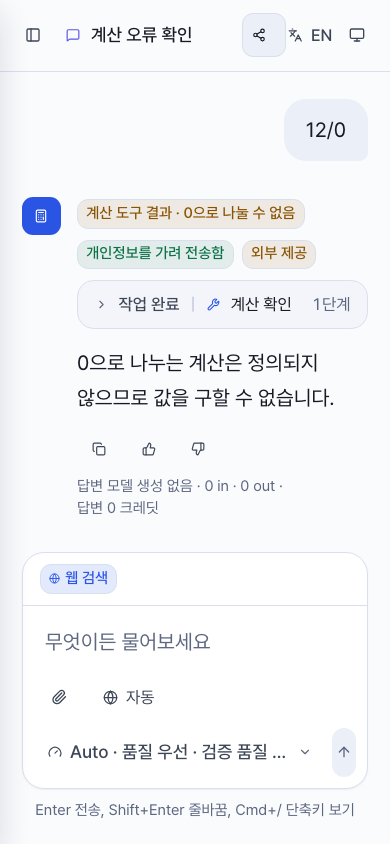

# Calculation tool verification

## Scope

Issue #178 covers ordinary chat requests with clearly supplied numeric arithmetic.
KloudChat already has a bounded, Fraction-based calculator and an explicit NCS
verification skill. This change addresses skipped verification, not a missing
calculator, and does not close the broader NCS quality issue #142.

- Recognized arithmetic requires a permitted, read-only built-in calculator before
  answer text is released. Agent allowlists and tool-support requirements remain
  authoritative; an unavailable calculator returns an actionable HTTP 409.
- A single literal expression supplied by the user can be copied to the calculator
  after bounded AST validation. The server neither evaluates it nor invents a
  word-problem equation. For other recognized requests the model supplies the
  expression, while a successful arithmetic tool result gates the answer.
- The required first stage exposes only the required tool schema. General
  arithmetic can verify multiple expressions; the existing NCS gate remains
  exclusive. Successful duplicate calls reuse per-turn evidence without executing
  the same calculation again. Failed calls do not unlock the answer.
- Ignoring named `tool_choice` receives one bounded protocol reminder. Unverified
  draft text is discarded; a second refusal to call the tool results in a hold.
  Tool-hop limits and unrelated tool permissions are unchanged.
- Auto economy keeps the tool-capable quality model for these requests and shows
  the reason in both streamed and saved messages. Auto quality retains its existing
  classifier and model-selection behavior.

Dates, version strings, code creation, translation, editing commands, explicitly
missing inputs and declined calculation have negative regression cases. This is
a conservative request classifier, not a general semantic guarantee. Attachments
without an explicit request, anaphoric follow-ups, spelled-out numbers and inputs
over the bound remain outside the required-calculation policy. Compare and document
routes are not covered by this ordinary-chat gate.

## Verification

The API suite ran with real socket connections and HTTPX network transports denied.
UI tests use synthetic API/SSE responses and a real Chromium page, not a live model.

| Check | Result |
| --- | --- |
| Main `2518c2e` API baseline | 2,410 passed, 1 skipped |
| Candidate `412c77d` API suite | 2,653 passed, 1 skipped |
| New API regressions | 243 cases, including required schema, routing, literal extraction, repair and deduplication |
| Browser regressions | 6 passed: refusal on desktop/mobile; Auto reason on saved/streamed desktop/mobile |
| Web lint/build | Passed; pre-existing lint, CSS selector and chunk-size warnings remain |

An isolated temporary database and local API also exercised three unchanged
synthetic questions against the configured `strict-local/qwen3.6-35b` route.
The catalogue reports this route as zero-credit and tool-capable. This does not
attest the provider's physical execution location. Title generation was explicitly
stubbed and automatic memory disabled in this bounded harness.

| Question | Main `2518c2e` | Candidate `412c77d` |
| --- | --- | --- |
| `17 * 23` | Correct 391, calculator skipped | Correct 391, one successful calculator execution |
| 12 people averaging 70 and 8 averaging 95 | Correct weighted average 80 and grading | Correct weighted average 80 and grading; one successful calculation |
| Increase from 80 to 100 | Correct 25% and grading; failed call then recovery | Correct 25% and grading; failed call then recovery |

Each three-case run used 6 completion requests, consumed 0 reported credits and
created 0 artifacts. Candidate execution made 4 calculator calls: 3 successful and
1 invalid call. Temporary database, network, credentials and files were removed,
ports closed, and the original database state and stopped status restored.
The gateway boundary was an application transport allowlist, not an OS firewall.

Earlier candidates held one otherwise answerable question because Qwen ignored
the required tool call. These were usability failures, not correct answers.
The final three-case run did not exercise the ignored-call repair; that branch is
covered by deterministic regressions. Repeated stochastic runs do not isolate a
causal accuracy gain, and three correct numeric outcomes do not establish a general
accuracy rate or complete explanation quality.

The tested API was subsequently rebased onto `f537972`; the only additional API
change from upstream was its unrelated default monthly-credit setting. Evidence
must be associated with the recorded source SHA, not presented as a release test.

## Follow-up verification

The follow-up source `d84245fb83213e423e781a6e7b71c31690bb0073` also
distinguishes a calculator-authored failure from a model-generated answer.
Only a literal expression copied from the user, the actual built-in calculator,
its typed division-by-zero result, and no attempted answer-model request qualify.
Model-composed expressions and other tool failures retain the existing retry/hold
behavior. Malformed expressions and choices are validated before the typed result.

The fixed answer has `answerOrigin=tool_result`, `model=null`, zero answer usage,
and no answer charge or title/memory/artifact enrichment. Privacy metadata and any
earlier search ledger or Auto classifier audit are preserved. Model selection,
headroom/key preparation, and Auto quality classification can precede the answer;
this is not a promise of zero upstream work or zero whole-turn cost in every mode.

| Actual manual-route replay | Answer origin | Answer completions |
| --- | --- | --- |
| `12 / 0` with a brief-answer instruction | Calculator explains division by zero; persisted model null | 0 |
| `12 / (3 - 3)` with the same instruction | Calculator explains division by zero; persisted model null | 0 |
| `12 / 3` normal control | Qwen answers `12 / 3 = 4` after calculator execution | 1 |

This three-case run made three calculator dispatches (two expected arithmetic
failures and one success), one completion, zero reported credits and zero artifacts.
Stored failure answers have an empty `actualModels` list. All temporary resources
were removed and the original read-only source data/stopped database preserved.
The earlier `86aadbf` run failed the two provenance expectations: the literal
extractor did not recognize the benign Korean brief-answer suffix, so it called
the model and held generically. Four real `send_message` regressions reproduced
that failure before the suffix fix; the same live questions were then replayed.

Uncustomized ordinary chat now omits the built-in NCS checker unless the current
or retained user request explicitly needs NCS/quiz grading. All Agent, project,
skill, attachment and other custom contexts preserve their existing tool selection.
The calculator is retained, the catalogue is unchanged, and no excluded permission
is added. Missing-data prompts do not receive invented equations or forced tools.

A separate paired five-question run compared `b930a520` and `56db6ca8`: three
missing-data requests, one explicit NCS control and one literal multiplication.
Both versions gave correct core limitations/calculations; each made six completion
requests and two successful calculations with zero reported credits/artifacts.
The baseline exposed checker protocol in two responses (three fully satisfactory
answers); the candidate removed that protocol but one response was unnecessarily
long and added unverified conditional examples (four fully satisfactory answers).
Those examples were numerically correct, but are a remaining quality limitation.
One stochastic observation per prompt is not a general accuracy estimate or causal
proof that removing a schema alone improved prose.

Follow-up regression results: **2,783 API passed, 1 skipped**, real network blocked;
**12 mock-browser cases passed**, including saved/streamed/buffered tool provenance,
normal model-answer control, mobile geometry and retained privacy badges. Web
build/lint and four configuration tests passed. Existing CSS selector warnings
are addressed independently by PR #186, not silently included in this PR.

## Remaining limits

A calculator proves arithmetic on its supplied expression. It does not prove that
the expression matches every condition in a word problem, that a selected option
has the right meaning, or that the final model explanation faithfully uses the tool
result. In particular, an incorrect student's reasoning cannot be inferred merely
from their selected answer. These limits remain part of #142 rather than being
counted as solved by the tool-use gate.

## UI evidence

The screenshots show synthetic mock-browser verification, not provider execution.

