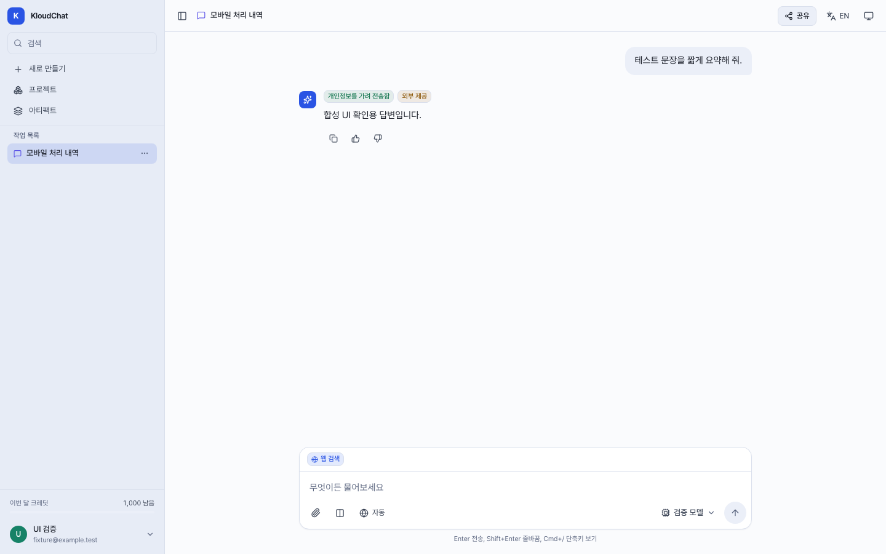

# 모바일 미디어쿼리 경계 검증

## 원인과 변경

- 기준은 `upstream/main`의 `f53797251940ff6ddbc0d0eff657a1779664aa51`임. 이 검증 화면은 해당 기준에 모바일 CSS 수정만 적용한 합성 UI이며 계산 PR #183과 최신 정보 검증 PR #184의 기능은 포함하지 않음.
- `phone` variant의 축약 선언에서 쉼표 뒤 `(max-width: 40rem)`이 미디어쿼리가 아닌 선택자로 생성되어 빌드 시 `Invalid dangling combinator` 경고 12개가 발생함. 최적화된 CSS에는 터치 포인터 분기만 남음.
- Tailwind의 [블록형 custom variant와 `@slot`](https://tailwindcss.com/docs/adding-custom-styles#adding-custom-variants)으로 선언만 변경함. 기존 미디어 조건, 루트 글자 배율, 글자 크기 값 및 컴포넌트 디자인은 변경하지 않음.
- 적용 조건은 `coarse` 포인터에서 1024px 이하, 또는 포인터 종류와 관계없이 640px 이하임. 좁은 fine-pointer 화면에서도 처리 내역 접기, 글자 크기와 줄 높이 등 기존 `phone:` 규칙이 적용됨.

## 재현과 결과

- 최초 8개 경계 검사에서 fine-pointer 390/639/640px의 3개가 실패하고 나머지 5개가 통과함. 실패 화면은 처리 내역 버튼이 숨겨지고 배지가 펼쳐져 있으며 입력창 글자 크기가 의도한 22px 대신 20.625px로 계산됨.
- 수정 후 1440px 데스크톱 대조군을 추가한 9개가 개발 서버와 production preview에서 모두 통과함. 전용 설정으로 다시 빌드한 production preview에서도 같은 9개를 재검증함.
- fine-pointer는 390/639/640/641/1440px, coarse-pointer는 390/768/1024/1025px를 검사함. 각 컨텍스트의 실제 `matchMedia` 결과와 계산 스타일을 함께 확인함.
- 처리 내역 버튼과 배지의 표시 상태, 루트/입력창/사용자 말풍선 글자 크기, 입력창 줄 높이, 처리 내역 열기/닫기, 입력창과 말풍선의 수평 경계, 문서 가로 넘침 0을 확인함.
- 수정 전 CSS 경고 12개가 수정 후 0개로 줄어듦. 기존 번들 크기 경고는 남음. 웹 lint는 기존 경고 196개, 오류 0개이며 새 회귀 파일에 경고가 없음.
- 기존 Auto 비용절약/품질우선의 유지 사유, 품질 상향 이력, 영어 표시 회귀를 desktop 1440px와 narrow fine-pointer 390px에서 실행하여 8개가 통과함.




## 회귀 실행

```sh
cd apps/web
npm run test:config
npm run lint
npx playwright test --config playwright.phone.config.ts --workers=1
```

- 전용 설정은 `npm run build`가 성공한 뒤 `127.0.0.1:5191`의 production preview를 실행함. `strictPort`와 `reuseExistingServer: false`로 다른 서버를 재사용하지 않으며 검사 후 소유 서버를 종료함.
- 단일 Chromium 프로젝트/worker를 사용하고 각 테스트가 포인터와 화면 크기를 지정함. 공용 Playwright 설정은 변경하지 않음.
- 모든 API 요청은 로컬 fixture가 처리하고 외부 origin 요청은 차단함. 실제 계정, API, DB, 모델을 사용하지 않음. 스크린샷도 합성 답변을 렌더링한 실제 브라우저 화면임.
- CI의 기존 슬라이드 발표 검사 뒤에 전용 9개 회귀를 추가함.

## 별도 잔여와 한계

- `auto-routing.spec.ts`의 데스크톱 전체 모델 정보 폭 검사 2개는 `toBeVisible` 직후 `boundingBox()`가 `null`을 반환함. 원본 CSS로 되돌린 대조에서도 4회 모두 동일하게 실패했으며 이번 CSS 변경으로 생긴 결함으로 판정하지 않음. 정확한 발생 원인은 별도 조사 대상으로 남기고 기존 테스트를 수정하지 않음.
- 실제 휴대전화/태블릿 하드웨어, Safari/WebKit, 다른 포인터 구현은 검사하지 않음. Chromium의 포인터 에뮬레이션과 CSS/DOM 결과를 검증한 범위임.
- 이 변경은 기존 반응형 규칙의 누락을 복구하는 작업이며 전체 모바일 사용성이나 모든 페이지의 적합성을 보장하지 않음.
