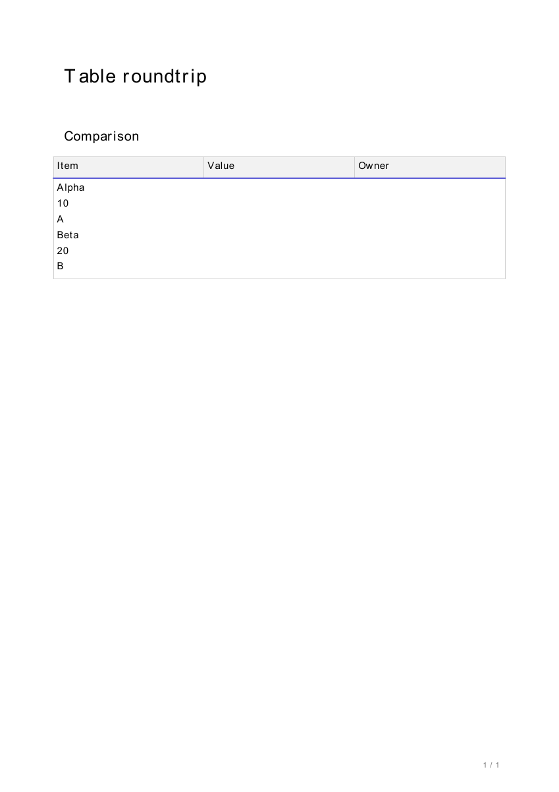

# 보고서 병합 행 내보내기 검증

## 재현과 변경

- 기준 main: `f53797251940ff6ddbc0d0eff657a1779664aa51`임.
- 실제 production 브라우저에서 3열 표의 마지막 2행 전체를 병합한 저장 JSON을 fixture로 사용함. `colspan="3" rowspan="2"`와 마지막 빈 `<tr></tr>`가 저장·재조회에서 유지됨을 확인함.
- 수정 전 DOCX·HWPX·PDF에서 3행이 2행으로 줄고 가로·세로 병합이 사라짐을 재현함. 세 형식 실패, 부분 병합·분할 6개 대조군 통과를 확인함.
- HTML Grid와 변환 Markdown의 빈 구조 행을 보존함. 실제 Grid가 매칭된 표에만 빈 구조 행 해석을 적용함. 매칭되지 않은 연속 구간은 Grid 없는 기존 Markdown 파서로 다시 해석함.
- DOCX·PDF·HWPX 공통 전처리에서 구조 행을 유지하되, 일반 Markdown 빈 행 정리와 전부 빈 표의 생략 동작을 유지함. 기존 문서 생성 라이브러리는 변경하지 않음.

## 자동 검증

- 새 테스트 43개 통과함. 브라우저 fixture 3개 × 3형식의 9개는 합성 SQLite에서 실제 FastAPI PATCH·GET·버전 기록·내보내기 경로를 검증함. 인증 의존성만 합성 사용자로 대체함. 나머지는 파서·실제 파일 생성 대조군임.
- DOCX는 생성 파일의 `word/document.xml`에서 행 수, `gridSpan`, `vMerge`, 셀 내용을 검증함.
- HWPX는 `Contents/section0.xml`에서 행·열 수, `cellSpan`, 셀 내용을 검증함.
- PDF는 파일의 텍스트와 실제 drawing operator를 읽어 병합 영역 내부 선 제거와 남은 셀 경계를 검증함. ReportLab의 행·열 수와 SPAN 명령도 별도로 검증함.
- 앞·중간·마지막 빈 행, 전체·부분 병합, 분할, 일반 Markdown, 전부 빈 표를 대조함.
- 보고서·richtext·디자인·HWPX·다중 처리 focused 581개 통과함.
- main 기반 전체 offline API 2,453개 통과, 1개 skip, 기존 warning 11개임. 별도 하네스에서 실제 socket·HTTP 전송을 차단했고 socket 시도 82개 차단, 실제 HTTP 전송 0개임.
- 변경 Python 파일 Ruff와 `git diff --check` 통과함. API-only 변경이므로 Web build 변경 없음.

재실행 범위:

```sh
PYTHONPATH=apps/api pytest -q apps/api/tests/test_report_table_roundtrip.py
```

## 혼합 표 후속 회귀 검증

- 최초 PR head `ab65f798`의 독립 리뷰에서, 무관한 HTML Grid가 같은 섹션에 있으면 별도 Markdown 표의 빈 pipe 행·colon 행이 기존 표 분리 대신 내용 행으로 해석되는 회귀를 확인함.
- 이미 사용한 Grid, 뒤에 있는 미사용 Grid, 일부만 일치하는 Grid와 연속 구분선의 9개 실패를 수정 후 통과로 확인함. 구조화되지 않은 구간의 원문 행 순서를 보존해 기존 파서에 전달함.
- 실제 구조 Grid와 일반 Markdown이 앞뒤로 놓이는 경우, 문단 없이 인접한 경우, 실제 HTML 표끼리 인접한 경우, 세 형식 출력 대조를 포함해 후속 테스트 17개를 추가함.
- 무관한 Grid를 둔 5,461개 결정적 표 행 조합이 Grid 없는 기존 파서와 동일함을 별도 확인함. 이를 전체 Markdown 문법의 완전성 증명으로 주장하지 않음.

## 출력 대조

- 같은 입력으로 기준 소스와 수정 소스의 실제 출력 내용을 비교함.
- 순수 Markdown 8개 × 3형식의 24개 내용 해시가 동일함. DOCX document XML, HWPX section XML, PDF content stream을 비교해 생성 시각 메타데이터 영향을 제외함.
- 부분 병합·분할 × 3형식의 6개 내용 해시도 동일함. 전체 폭 병합 3개 출력만 변경됨.
- 혼합 표 후속 수정에서 순수 Markdown 24개는 기준 소스와 동일하며, 기존 병합·분할 fixture 9개는 최초 PR head의 XML·PDF content stream과 동일함. 별도 혼합 표 대조군의 세 형식은 Grid 없는 기존 해석 결과와 동일함.
- 수정 전 DOCX는 2행이며 병합 요소가 없고, 수정 후 3행과 colspan 3·vMerge restart/continue가 존재함.
- 수정 전 HWPX는 2행·1×1 셀 6개이며, 수정 후 3행·머리글 셀 3개·3×2 병합 셀 1개임.

## PDF 렌더

실제 생성 PDF를 로컬 Poppler `pdftoppm`으로 렌더링해 눈으로 확인함. 아래 이미지는 내부 열 경계의 차이를 보여 주며, 숨은 행 수·rowspan의 정확성은 위 구조 검증으로 확인함.

수정 전:


수정 후:



## 검증 한계

- UI 변경 없음. 보고서 파일 내보내기 결과만 수정함.
- 브라우저 저장 데이터는 fail-closed API mock으로 수집하고 같은 데이터를 합성 ASGI API에 전달해 별도 검증함. 이를 사용자 DB를 사용하는 단일 live end-to-end 검증으로 주장하지 않음.
- 원본 사용자 DB·외부 모델·유료 API를 호출하지 않음. PostgreSQL 운영 배포, 실제 인증, Word·한글 앱의 네이티브 열기까지 검증했다고 주장하지 않음.
- 기존 한글 PDF fallback 폰트 경고는 별도이며 이 fixture는 ASCII 내용을 사용함.
- 모델이 보고서 수정 지시를 제대로 수행하는지는 이번 수동 편집·내보내기 검증 범위가 아님.
