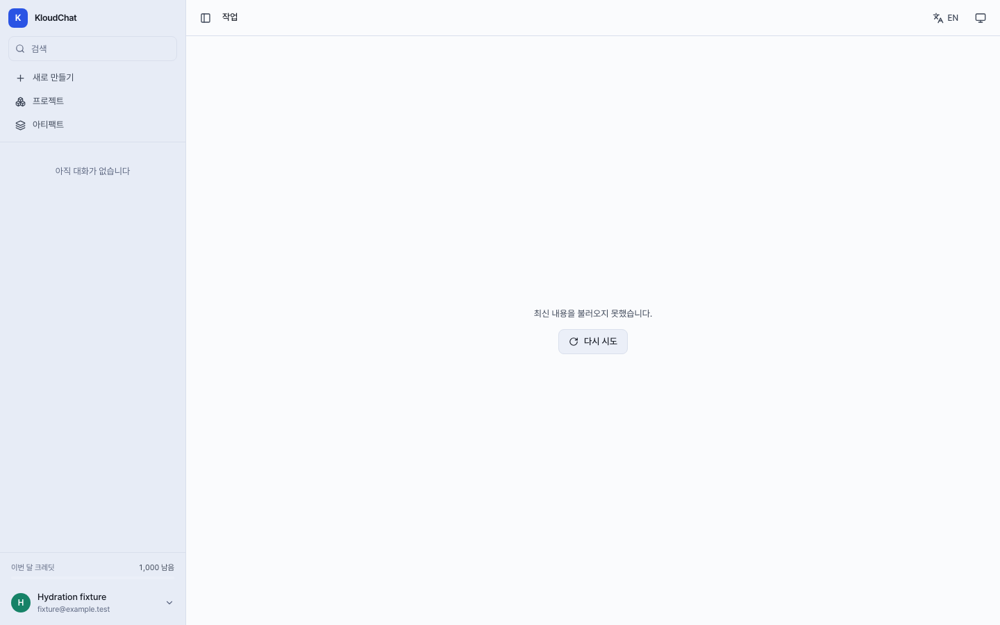

# Session metadata hydration verification

## Scope

- Baseline: `f53797251940ff6ddbc0d0eff657a1779664aa51`.
- Preserve the original session kind and Agent identity when authenticated session metadata or the Agent catalogue arrives late.
- Before a session row is available, render a loading state instead of treating the unknown session as a new chat. A failed detail lookup displays the existing retry action.
- Use the persisted `session.agentId`, not the independently loaded Agent catalogue, to decide whether a chat can hand a document request to another surface.
- The store/API contracts, ordinary chat-to-document handoff, and new-session creation are unchanged. This is a functional context-preservation fix, not evidence of an authorization or data-disclosure defect.

## Before and after

Two focused baseline browser cases failed before the product edits:

1. A report deep link with session list/detail responses held open exposed the chat composer. Sending a document request created another report and sent to the new ID instead of the original report ID.
2. A chat session with a persisted Agent ID and a delayed Agent catalogue also handed the request to a new report. The existing empty-session cleanup subsequently deleted the original empty Agent session.

The assertions record the mocked HTTP mutations, not just the placeholder text. No real session was created or deleted.

The final production-preview suite passes all **30 cases**, with retries disabled:

| Boundary | Desktop | Mobile |
| --- | ---: | ---: |
| Chat/report/slides, list-first and detail-first metadata | 6 | 6 |
| Failed detail lookup (404/503), blocked send, successful retry | 2 | 2 |
| Persisted Agent ID before Agent catalogue | 1 | 1 |
| Ready non-Agent chat retains ordinary report handoff | 1 | 1 |
| Late failure for A after navigation to loaded/pending B | 2 | 2 |
| New chat/report/slides creation | 3 | 3 |
| Total | 15 | 15 |

Held requests use explicit test-controlled promises rather than sleep-based timing. Both metadata sources can independently unlock the correctly typed composer. The navigation cases verify that a late failure for another ID cannot replace the current loading or ready state.

The first post-fix harness used Vite development mode: 4 cases passed and 14 reached an unexpected-WebSocket assertion because Vite HMR opened connections. The harness was changed to production preview while retaining the strict WebSocket block. An intermediate 28-case production run passed; two normal-handoff controls brought the final suite to 30 passing cases. The HMR failures are test-environment failures, not omitted product failures.

## Other checks

- Web build and lint pass; existing bundle-size/lint warnings remain.
- The unchanged API suite passes: **2410 passed, 1 skipped, 11 warnings**.
- `git diff --check` passes.
- A dedicated CI step runs the 30 browser cases with its own build and preview server.

## Reproduction

From `apps/web`:

```sh
npm ci
npx playwright install chromium
npx playwright test --config playwright.session-hydration.config.ts --workers=1
```

The config owns port `5303` and refuses to reuse an existing server. All application API responses and streams are synthetic; unexpected requests are blocked, service workers are disabled, and WebSockets are blocked. No real application API, database, provider, or credential is used. These results do not establish live model output quality or complete application-wide browser coverage.

## Screenshots

The images are from the final mock production-preview run, with synthetic account data.



